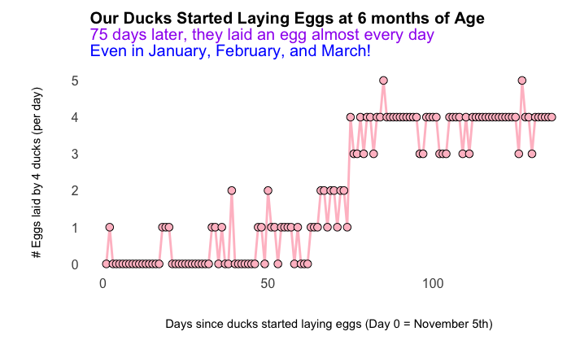

# Ducks eggs laid in our garden 🦆🥚

## Background

We brought home four few-day-old ducklings in 2020; two white crested ducks on April 10th and two khaki campbell ducks on May 14th.  They started laying eggs in November and I've been collecting data on the quantity of eggs ever since.  

According to the American Poultry Association:
* White Crested ducks lay 100-150 eggs per year
* Khaki Campbell ducks lay 250-340 eggs per year

But the actual data are so much more interesting!

## Number of eggs laid by day (2021 and 2022)

The R script *Number of Duck Eggs Laid by Day.R* uses the data from the CSV file *data_eggs_laid.csv* to generate the GIF with two plots *GIF of Number of Duck Eggs Laid by Day.gif*

The egg-laying data was collected from our four ducks.

### Our Four Ducks' Egg-Laying Timeline When They First Started Laying

* November 6:  Our ducks laid their first egg!
* November 22: Our ducks laid their second egg!
* December 13: Our ducks laid two eggs in one day!
* January 5:   The last day without any eggs laid.
* January 17:  The last day our ducks laid less than three eggs. 
* January 18:  Four eggs in one day for the first time!
* January 28:  Five eggs in one day (Four eggs the day before and four eggs the day after)!
* February 24: The start of a 14-day four-egg-laying streak!
* March 11: 	 Five eggs in one day (three eggs the day before and four eggs the day after)!

### Five Eggs in One Day?  From Four Ducks?

I had read that ducks and chickens lay at most an egg per day.  But experience taught me otherwise.  Therefore, I embarked on further research and found that our ducks were not unique in this regard.  Breeds such as our khaki campbells are known to sometimes lay more than one egg per day, until the young layers have their hormones stabilize. 

